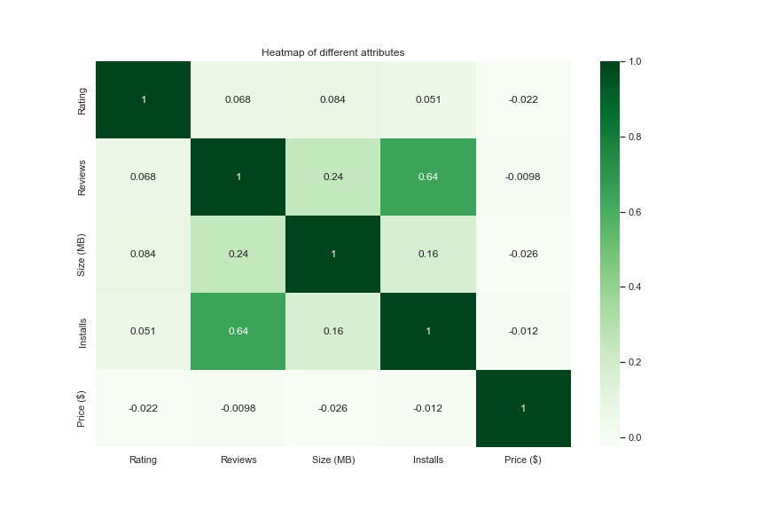
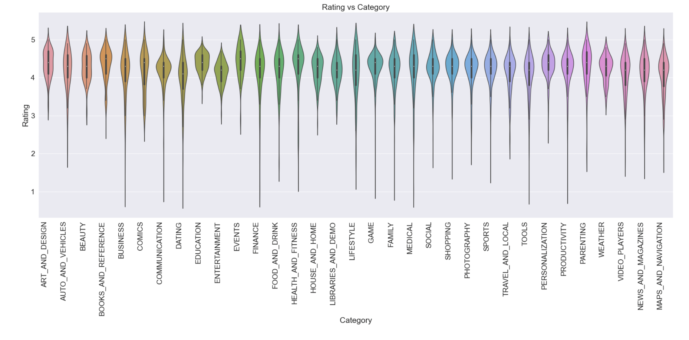
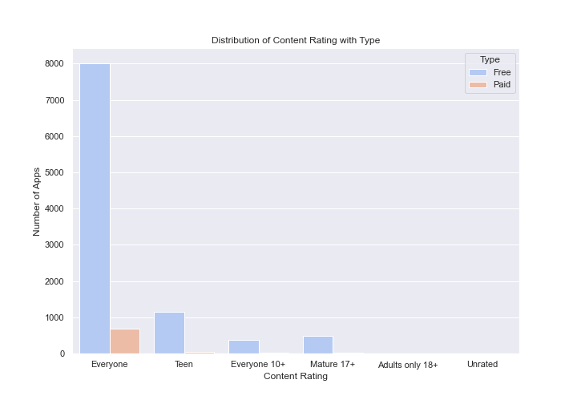
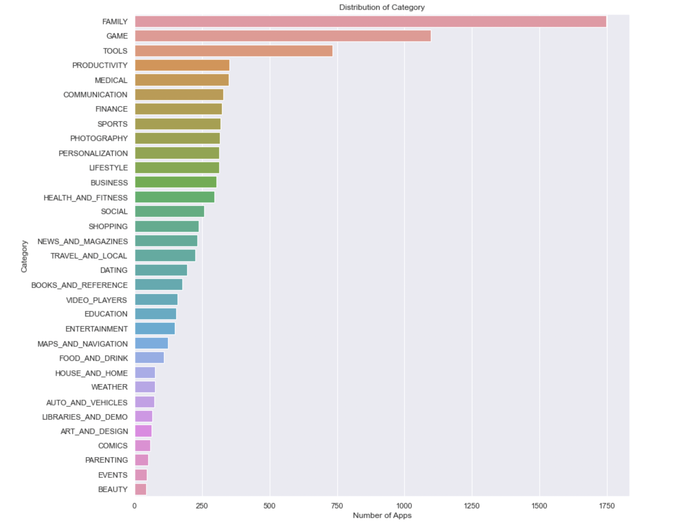
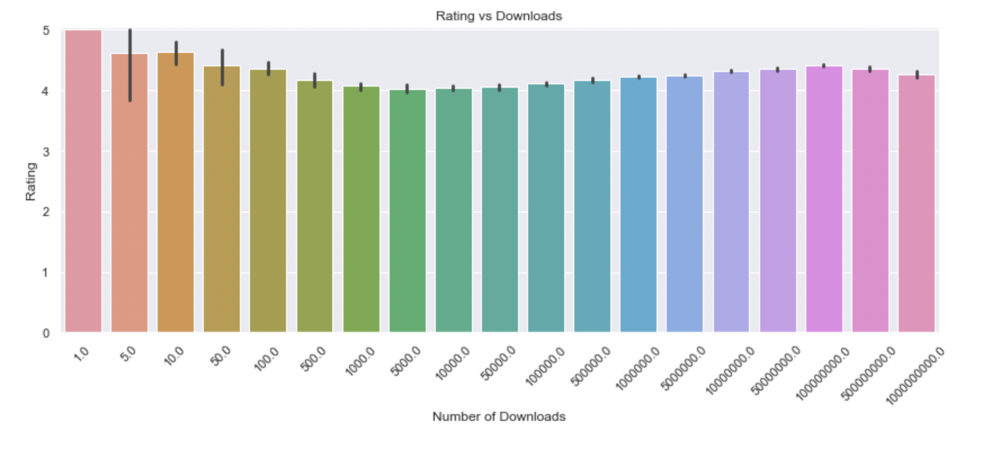
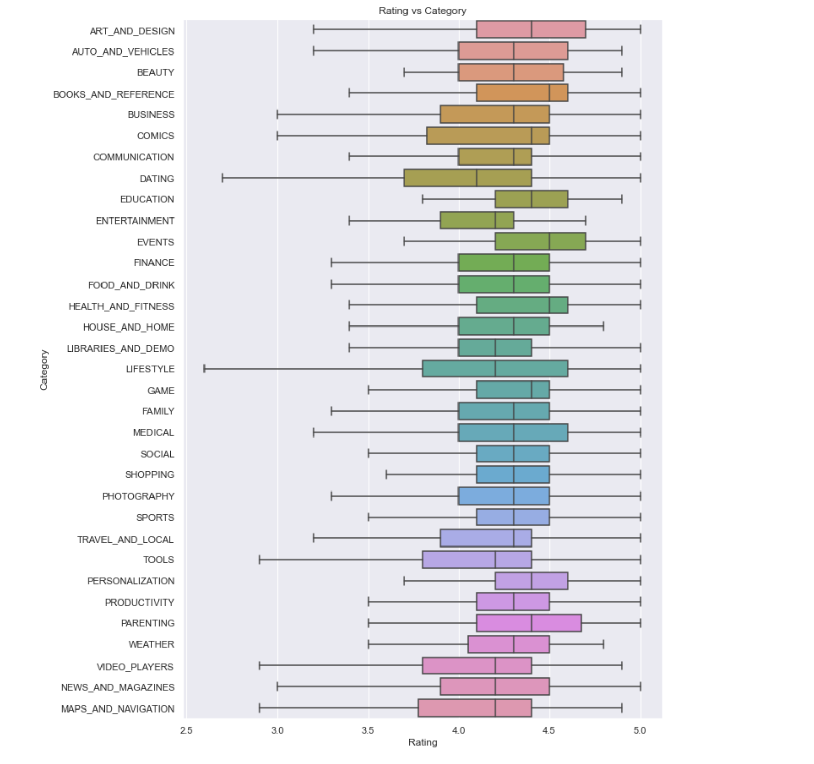

# Introduction

In the hyperconnected world today, most of us spend a lot of time on our phones on a daily basis. The majority of this time is spent using applications that span a broad range of categories. Depending on the type of device you own, these applications can be seamlessly downloaded from two main digital distributors - the Google Play Store and the Apple App Store. For this project, our group explored a dataset on a collection of applications on the Google Play Store. Our group was interested in analyzing this dataset to explore three main topics - Installs, Ratings and the overall share of apps depending on various attributes. A lot goes into creating a successful app and app developers spend a lot of time trying to create apps that can be widely used by their target audience. Our motive with this analysis was to try and gain insights that can inform app development and to gain a better understanding on how various factors might affect how the app performs.

You can find the links to the dataset and the full analysis notebook here:

[Dataset Link](https://www.kaggle.com/datasets/lava18/google-play-store-apps)

[Analysis 1 Notebook Link](notebooks/analysis1.ipynb)

[Analysis 2 Notebook Link](notebooks/analysis2.ipynb)

[Analysis 3 Notebook Link](notebooks/analysis3.ipynb)

# Exploratory Data Analysis

Through our exploratory data analysis, we confirmed some of the things we already suspected and found new pieces of information that helped inform our analysis. In addition, we found the number of rows, columns and unique values of diferent attributes in the dataset. We also identified null values, outliers and the range of values that each attribute takes on. To begin with, we use a heatmap to see how various app related attributes in this dataset are correlated to each other.
 

It is evident that reviews and installs have the strongest positive correlation. This makes sense as in most cases, higher reviews would encourage more people to download a specific app. We can also see that Rating and Price have the worst correlation. We suspect this is because users who have paid for apps would have higher expectations and are more likely to be critical if the app doesn't meet their expectations.

Our earlier findings are consistent in this visualization where we can see that app ratings are generally high across all categories with most app categories having an overall rating above 4. Apps in the Health and Fitness category tend to have better ratings than the rest while apps in the dating category did not seem to perform as well with around 50% of apps in it falling below the 4 rating.

With this visualization, we can see how apps in this dataset are distributed across content ratings along with whether they are free or paid. Most apps have the ‘Everyone’ content rating and paid apps are a significantly smaller proportion of overall apps in each content rating. 

# Question 1: Which type of Apps have the highest share on the google play store?

You can find the full analysis notebook of this research question here, including the code and the data:

[Analysis 1 Notebook Link](notebooks/analysis1.ipynb)

### Visualization 1: Distribution of Category

### Observations:
The Family category has the highest share of apps, followed by the Game category.

The Tools and Productivity category has also caught up.

The Beauty and Events category has the least number of apps.

### Visualization 2: Proportion of Free and Paid Apps

### Observations:
The majority of the apps available on the google play store are free with a share of 93.1%.

Only 6.9% of the apps found on the play store are paid.

### Visualization 3: Distribution of Content Rating

### Observations:
Most apps on the google play store are meant for all users, irresrespective of their age.

There are very few unrated and adult-only apps available.

### Visualization 4: Distribution of Size by Type

### Observations:
Both free and paid apps have a very similar distribution in terms of their size.

More than half of the apps available on the google play store have a size between 5 MB and 33 MB.

## Summary and Conclusion:
1. The apps belonging to the Family and Game category have the highest market prevelance. It's interesting to note that the Tools and Productivity apps are also catching up. The google play store is least tailored towards customers looking for apps of the Beauty and Events category.

2. The majority of apps available on the Google Play store are intended for all users, regardless of their age. The number of unrated and adult only apps are very minimal. This is done so that the apps are accessible to a wider audience.

3. A large proportion of apps in the google play store are free (93.1%). As a result, the play store attracts those audiences that are purely searching for only free applications. The rest apps are paid (6.9%). Most of the paid apps on the google play store cost under 20$, which is niether too cheap nor too expensive. Hence, it is targeted to customers of any income.

4. A large share of apps are optimally sized between 5 MB and 33 MB. This means that the size of the apps are generally neither too light nor too heavy. Hence, the customers will not need to be worried about an app taking a large amount of memory from their device.

# Question 2: What are the factors that might affect install rates of an app?

You can find the full analysis notebook of this research question here, including the code and the data:

[Analysis 2 Notebook Link](notebooks/analysis2.ipynb)

### Visualization 1: Barplot showing the relationship bewtween App Categories and App Installs

### Observations:

The top 3 app categories for total installs are Communication, Social and Productivity.

The least downloaded apps are Medical, Events and Parenting.

This makes sense as most of us use our phones for communication, using social media and to keep our life organized through increased productivity. The apps belonging to the least downloaded categories cater to a certain subset of the population and are not likely to appeal to the wider population of people who download apps through the Play Store.

### Visualization 2: Barplot showing the relationship between Rating and Installs

### Observations:
Higher App Ratings lead to higher number of Installs.

The most installed apps are rated between 4 and 4.5

App installs fall for every increment below 4.

Apps rated less than 2.5 are barely installed and account for even less installs than the next group, 2.5 - 3

If this pattern were consistent, apps rated above 4.5 should have been installed the most. It is likely however that ratings that high are hard to achieve and that is why they're not at the top.

### Visualization 3: Barplot showing relationships between App Installs and App Size

### Observations:

Higher App Sizes account for a higher number of Installs.

The most installed apps are between 60 - 80 MB.

App installs fall for every increment below 60 MB.

Least installed apps have sizes between 0 - 20 MB.

This is most likely because apps with higher app sizes can provide more functionality and are more feature rich than lower sized apps.

This shows that bigger app sizes are not a limitation and people are willing to install them if they get what they need.

### Visualization 4: Barplot showing relationships between App Installs and App Rating with Size distributions

### Observations:

Earlier findings are fairly consistent with most rating groups having apps sized 60 - 80 MB being most installed.

Apps in the 3.5 - 4 rating group are the only different ones wheres apps sized 0 - 20 MB take the lead.

This could be becuase apps in this group are a lower overall proportion than apps rated higher and could lack functionality that comes with higher app sizes that could lead to better ratings.

## Summary and Conclusion:
1. Apps that belong to categories that have a mass appeal are more likely to be installed with apps being in the communication, social and productivity categories being the most installed. Developers should therefore try to create apps that can be used many people and even if they want to target a specific niche, they could try adding social and communication feautures to their apps to boost their install rates.

2. Higher ratings lead to a higher number of installs. So developers should continously monitor app reviews and implement changes requested by their users to increase app rating.

3. People do not mind downloading bigger sized apps so while developers should not create bloated apps just to increase size, they should not hesitate in adding additional functionality because their app size might increase.

# Question 3: What factors affect the rating of an app and how do they affect it?

You can find the full analysis notebook of this research question here, including the code and the data:

[Analysis 3 Notebook Link](notebooks/analysis3.ipynb)

### Visualization 1: Rating vs Downloads

### Observations:

Apps with very less downloads are highly rated.

Generally, users use popular apps more as they tend to have more utility and are thus able to find flaws and end up rating them lowly.

People are very generous with rating apps all round.

### Visualization 2: Rating vs Size

### Observations:
The rating of an app increases as its size increases.

Most people rate apps between 4-5 and we can clearly see that this is where the bulk of the distribution takes place.

### Visualization 3: Rating vs Content Rating with Type

### Observations:
There is no substantial difference between Audience and rating, which is fairly reasonable.

Paid apps are higher rated in comparison to those apps that are free. This is although fairly marginal.

This range is rather massive, notably being exponential in nature.

### Visualization 4: Rating vs Category

### Observations:
Almost all app categories perform decently.

The highest rated categories are 'Health and Fitness' and 'Books and Reference'.

The lowest rated categories are 'Dating', 'Maps and Navigation' and 'Lifestyle'.

## Summary and Conclusion:

1. Since ratings are being quantized, most people just rate apps very highly and opinions converge towards somewhere between an average of 4-5 star rated apps. This does become more pronounced when apps are more popularly downloaded. Although while this average value is known to converge, curiously the deviation is more irregular in that it tends to be alot lesser on niche categories of apps such as those with few downloadsor of being a niche genre altogether.

2. On the whole, people have a large variety of responses to popular apps although predictably this aggregrates to the same rating of between 4-5 star more or less. This is contrast to niche apps which somehow have more people in united agreement of an app being either good or bad. Popular apps have an ambigius response from users.

3. I have also learnt that ratings are also sort of imprecise and that it does not reveal as much information as I originally anticipated. Perhaps if ratings were not quantized, and people could rate decimals between 4-5 star, I suspect more people would vote in that range than a 5* straight away. This could then reveal more data down the line.
